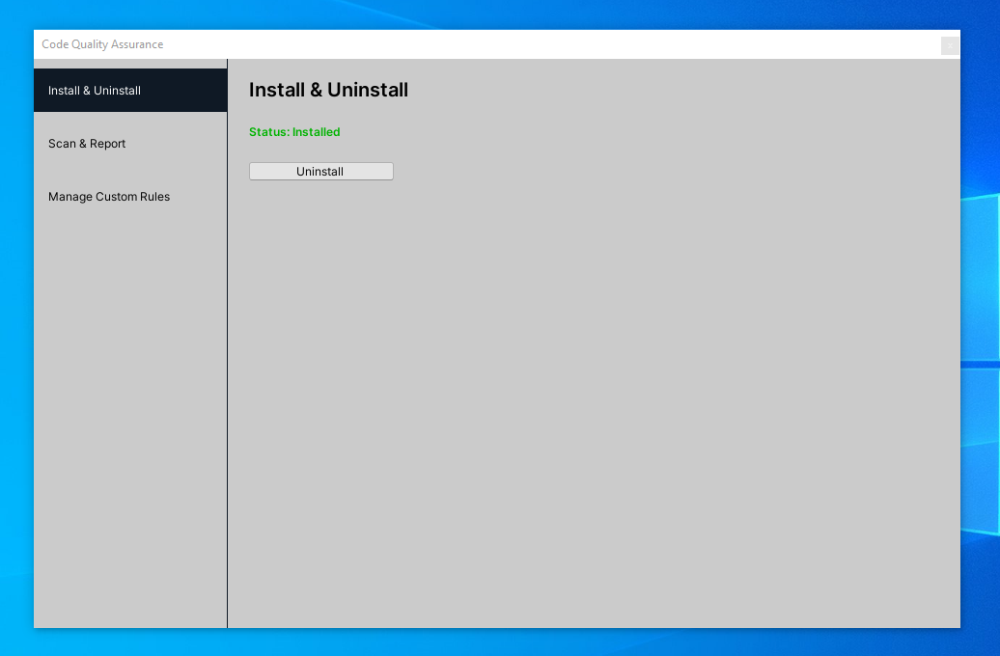
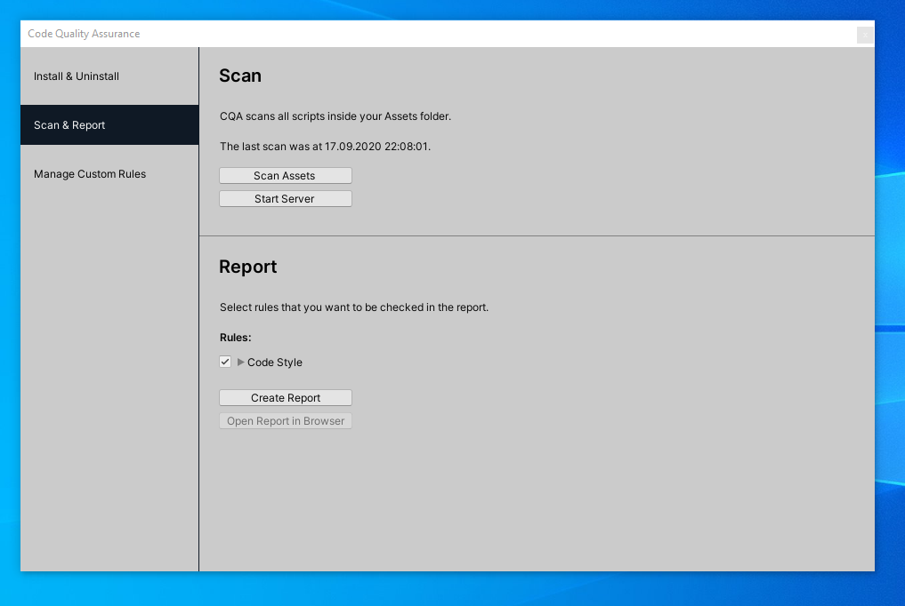
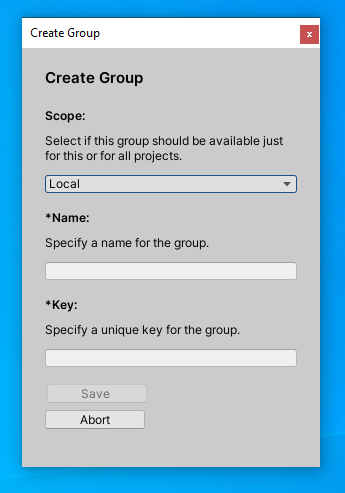

# CQA Handbook

With **CQA** we want to present a first approach of an open-source tool that allows to 
create rules that your codebase must fulfill. We know that the project is still in an early state and
there are a lot of things that could be improved. If you like the idea please consider
opening issues on [GitHub](https://github.com/PRODUKTIVKELLER/CQA/issues) so we know what you 
would expect from **CQA**.


## Table of Contents

* [Getting Started](#getting-started)
    + [Installation](#installation)
    + [Scan & Report](#scan-and-report)
    + [Custom Rules](#custom-rules)
      - [Create Rules](#create-rules)
        * [Create Group](#create-group)
        * [Create Rule](#create-rule)
        * [Explore Graph Database](#explore-graph-database)
      - [Select Rules](#select-rules)
* [Issues](#issues)


## Getting Started

You can open **CQA** via `CQA -> Code Quality Assurance`.

### Installation

If you open **CQA** for the first time you have to install it. 

> Under the hood it uses [jQAssistant](https://jqassistant.org/) and 
> the [C#-Plugin](https://github.com/softvis-research/jqa-csharp-plugin).
> The two projects get downloaded from `jqassistant.org` and `github.com`, respectively.

Click the **Install** button to start the installation process. For updates have a look at the **Unity** console.


If the installation is successful you will see a green text:



### Scan and Report

Switch to `Scan & Report` in the navigation menu on the left.

First, you need to scan your project. To do so click the **Scan Assets** button.  For updates have a look at the **Unity** console.

> You have to repeat this process whenever your codebase changes!


After the scan has finished you can create a report by clicking on the **Create Report** button:



Finally, after the report process has finished open the report in your browser by clicking the **Open Report in Browser** button:


The summary will give you an overview over all rules and whether they succeeded or not.

Below the summary you find the output for all rules. If a constraint is not met **CQA** will tell you which part of
your code can be improved:


We know that not every rule fits your project needs. That is why you can create your own rules. Just keep reading!

### Custom Rules

#### Create Rules

To manage your own rules select `Manage Custom Rules` in the navigation on the left.
There are two types of rules: Local and global.

**Local Rules:**

These rules will be saved in the `Assets` folder so you can share them with your team via your version control system such as **Git**.

**Global Rules:**

These rules will be saved for your user outside the project folder. This way you can access the rules in different **Unity** projects.

##### Create Group
Rules are organized in groups. So you have to create a group first.
To do this click on **Create Group**. A dialog will appear:



Select if this group should be `Local` or `Global`.

Enter a readable name for your group. 

> This name will be used for the rule-selection and as sub-heading in the report.

Finally, modify the technical key if you want.
**CQA** will try to make a suggestion.

Click save to close the dialog.


Your group should now appear in **CQA**.

##### Create Rule

Now lets create a rule. 
To do this click on **Create Rule**. 
This will open the rule dialog.

> We will create a variant of the maximum lines of code rule that is shipped with **CQA**.
> We will make it more strict than the shipped one, only accepting a maximum of 150 lines of code.

Select the group you just created.

Under *Key* enter `MaximumLOCPerClass150`.

For *Type* select `Constraint`. 

> If you want to know what a `Concept` is we suggest to read the [jQAssistant manual](http://jqassistant.github.io/jqassistant/doc/1.8.0/).

As *Description* enter `No class has more than 150 lines of code.`.

Under *Cypher Query* paste the following query:

```
MATCH
  (c:Class)
WHERE
  c.effectiveLineCount >= 150
RETURN
  c.fqn as FQN, c.effectiveLineCount as `Lines of Code`
ORDER BY
  c.effectiveLineCount DESC
```

As stated before, **CQA** uses a graph database: [neo4j](https://neo4j.com/). 
The query language of **neo4j** is called [Cypher](https://neo4j.com/developer/cypher/).
Every rule is written in **Cypher**.
A rule is met when the **Cypher** query DOES NOT returns entries. 

Let's analyze the **Cypher** query above:

`MATCH (c:Class)` select all nodes in the graph that are classes. 
`WHERE c.effectiveLineCount >= 150` filters out classes that have a line count smaller than 150.
`RETURN c.fqn as FQN, c.effectiveLineCount as 'Lines of Code'` creates a result 
table with two colums: `FQN` and `Lines of Code`.
Finally, the table is sorted with the highest line count being at the top: `ORDER BY c.effectiveLineCount DESC`.

So, if there are classes that have a line count greater or equal 150 they will be returned by this query. 
This means the rule would fail.

Now, close the dialog by clicking **Save**.

##### Explore Graph Database

It is not obvious which nodes, edges and properties are provided by **CQA**. 
Furthermore, there is neither syntax highlighting nor auto completion in the rule dialog.
To fix this gap you can use the **neo4j** web interface.

To do so, select `Scan & Report` in the navigation menu on the left.
Then click on **Start Server** in the upper half of the window.
This starts the **neo4j** server and opens the web interface in your browser under http://localhost:7474/browser/.

Now you can explore the database and write your queries with tool support from **neo4j**.
For more information on the web interface have a look at the [official documentation](https://neo4j.com/developer/neo4j-browser/). 

After you are done, copy the query from the web interface and make sure to stop 
the server by closing the console window that popped up earlier.

#### Select Rules

Now that you have created your own rule navigate to `Scan & Report` and deselect the shipped variant of your rule:


Click on **Create Report** to create a new report.

> You don't have to scan your code again as you did not change anything.

The shipped rule will not appear in the report anymore. 
Instead you should see your rule in the summary.
Beneath, you will find your group and the result of your rule:


## Issues

If you encounter any issues please help us to improve **CQA** by opening a ticket on [GitHub](https://github.com/PRODUKTIVKELLER/CQA/issues).